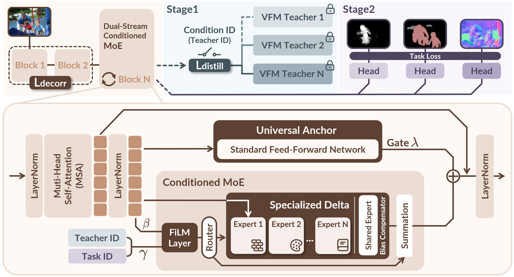

# PRISM: Synergizing Vision Foundation Models via Self-organized Expert Specialization

<p align="center">
  <a href="https://arxiv.org/abs/2606.03444"></a>
  <a href="https://github.com/robotyingtang/PRISM-VFM"></a>
  <a href="https://huggingface.co/robotyingtang/PRISM-VFM/tree/main/checkpoints"></a>
</p>

This repository contains the official implementation of **PRISM**, accepted to **ICML 2026**.

## TL;DR

Different Vision Foundation Models encode complementary visual biases. PRISM learns to decompose teacher-specific knowledge into self-organized experts, then dynamically recomposes these experts for downstream dense prediction tasks.



## News

- [2026-07-04] PRISM checkpoints released on [Hugging Face](https://huggingface.co/robotyingtang/PRISM-VFM).
- [2026-07-03] Code release preparation.
- [2026-06-02] Paper available on [arXiv](https://arxiv.org/abs/2606.03444).

## Abstract

Unifying the complementary strengths of diverse Vision Foundation Models (VFMs) into a single efficient model is desirable but challenged by negative transfer in monolithic distillation. PRISM addresses feature conflicts with a dual-stream Mixture-of-Experts framework. In Stage 1, teacher-conditioned routing drives emergent expert specialization. In Stage 2, task-conditioned routing recomposes the learned experts for dense prediction. Experiments on PASCAL-Context and NYUD-v2 show that sparse, self-organized specialization is effective for integrating heterogeneous visual knowledge.

## Setup

### Requirements

The recommended environment is Python 3.10 with PyTorch 2.5.

```bash
conda create -n prism python=3.10
conda activate prism
pip install -r requirements.txt
```

For cluster usage, `scripts/setup_env.sh` can be used as a template:

```bash
bash scripts/setup_env.sh
```

### Datasets

Stage 1 uses ImageNet-style data for distillation. Set the path in `datasets/custom_dataset.py`, or export `IMAGENET_ROOT` for the `imagenet` setting.

Stage 2 uses PASCAL-Context and NYUD-v2. Following the SAK data preparation protocol, the two datasets can be downloaded from:

- [PASCAL-Context](https://drive.google.com/file/d/1TWZydr5_r4hKDM5Zyzrcq712Stg2cw7p/view?usp=drive_link)
- [NYUD-v2](https://drive.google.com/file/d/1rj3tHdQVYqe-Y3mpxv4EgWsiqgq3z87H/view?usp=drive_link)

The default layout is:

```text
data/
  PASCALContext/
  NYUDv2/
  imagenet-1k/
```

You can also set a shared data root:

```bash
export DATA_ROOT=/path/to/data
export IMAGENET_ROOT=/path/to/imagenet-1k
```

### Pre-trained Models

Teacher checkpoints are expected under `pretrain/vfm/`, matching the filenames used in the config files:

```text
pretrain/vfm/
  dinov2_vitb14_pretrain.pth
  dinov2_vitl14_pretrain.bin
  vit_base_patch16_clip_384.bin
  vit_large_patch16_clip_336.bin
  sam_vit_b_01ec64.pth
  samvit_large_patch16.bin
```

PRISM checkpoints are released at [robotyingtang/PRISM-VFM](https://huggingface.co/robotyingtang/PRISM-VFM):

- [prism_stage1_vit_b.pth](https://huggingface.co/robotyingtang/PRISM-VFM/blob/main/checkpoints/prism_stage1_vit_b.pth)
- [prism_stage1_vit_l.pth](https://huggingface.co/robotyingtang/PRISM-VFM/blob/main/checkpoints/prism_stage1_vit_l.pth)
- [prism_stage2_pascal_vit_b.pth](https://huggingface.co/robotyingtang/PRISM-VFM/blob/main/checkpoints/prism_stage2_pascal_vit_b.pth)
- [prism_stage2_pascal_vit_l.pth](https://huggingface.co/robotyingtang/PRISM-VFM/blob/main/checkpoints/prism_stage2_pascal_vit_l.pth)
- [prism_stage2_nyud_vit_b.pth](https://huggingface.co/robotyingtang/PRISM-VFM/blob/main/checkpoints/prism_stage2_nyud_vit_b.pth)

Download with:

```bash
hf download robotyingtang/PRISM-VFM --local-dir pretrain/prism
```

## Usage

PRISM uses two training stages:

- **Stage 1**: teacher-conditioned expert decomposition.
- **Stage 2**: task-conditioned expert recomposition on PASCAL-Context or NYUD-v2.

### Train

**Stage 1**

```bash
torchrun --nproc_per_node=8 train_s1_condition_moe.py \
  --config_path configs/s1_prism/BB_s1.yml \
  --exp prism_s1_bb
```

**Stage 2: PASCAL-Context**

```bash
torchrun --nproc_per_node=2 train_s2_condition_moe.py \
  --config_path configs/s2_prism/pascal_s2.yml \
  --exp prism_s2_pascal \
  --checkpoint /path/to/prism_stage1_checkpoint.pth \
  --task_out \
  --fp16
```

**Stage 2: NYUD-v2**

```bash
torchrun --nproc_per_node=2 train_s2_condition_moe.py \
  --config_path configs/s2_prism/nyud_s2.yml \
  --exp prism_s2_nyud \
  --checkpoint /path/to/prism_stage1_checkpoint.pth \
  --task_out \
  --fp16
```

The provided SLURM scripts mirror these three training paths:

```bash
bash scripts/train_s1_moe_sbatch.sh
bash scripts/train_s2_pascal_moe_sbatch.sh
bash scripts/train_s2_nyud_moe_sbatch.sh
```

Common arguments include `--seed`, `--checkpoint`, `--resume`, and `--fp16`. Stage 2 additionally uses `--task_out` and `--alpha`.

### Test

```bash
python test_condition_moe.py \
  --exp prism_s2_pascal \
  --config_path configs/s2_prism/pascal_s2.yml \
  --checkpoint /path/to/prism_stage2_pascal_checkpoint.pth \
  --results_dir results \
  --evaluate
```

To save predictions:

```bash
python test_condition_moe.py \
  --exp prism_s2_pascal \
  --config_path configs/s2_prism/pascal_s2.yml \
  --checkpoint /path/to/prism_stage2_pascal_checkpoint.pth \
  --results_dir results \
  --evaluate \
  --save_predictions
```

#### Boundary Evaluation

Boundary evaluation follows the SEISM protocol used by SAK.

```bash
cd evaluation
git clone https://github.com/innovator-zero/seism.git
cd ..
python evaluation/edge_evaluation.py \
  --exp prism_s2_pascal \
  --results_dir results \
  --dataset PASCALContext \
  --nms
python evaluation/edge_evaluation.py \
  --exp prism_s2_pascal \
  --results_dir results \
  --dataset PASCALContext \
  --done
```

Use `--dataset NYUD` for NYUD-v2.

## Results

Main results are copied from the camera-ready ICML 2026 paper. Higher is better except for Normal mErr and Depth RMSE.

### PASCAL-Context (ViT-B)

| Model | Semseg mIoU | Parsing mIoU | Saliency maxF | Normal mErr | Boundary odsF | Delta_m (%) |
| --- | ---: | ---: | ---: | ---: | ---: | ---: |
| Single-task baseline | 80.25 | 70.54 | 84.54 | 13.57 | 74.22 | 0.00 |
| Multi-task baseline | 76.76 | 65.26 | 84.39 | 13.98 | 70.37 | -4.04 |
| InvPT | 77.33 | 66.62 | 85.14 | 13.78 | 73.20 | -2.28 |
| InvPT++ | 76.95 | 66.89 | 85.12 | 13.54 | 73.30 | -1.92 |
| TaskPrompter | 79.00 | 67.00 | 85.05 | **13.47** | 73.50 | -1.24 |
| TaskExpert | 78.45 | 67.38 | 84.96 | 13.55 | 72.30 | -1.73 |
| BFCI | 77.98 | 68.19 | 85.06 | *13.48* | 72.98 | -1.31 |
| MLoRE | 79.26 | 67.82 | **85.31** | 13.65 | *74.69* | -0.83 |
| RADIO | 78.06 | 68.13 | *85.18* | 13.59 | 72.64 | -1.53 |
| RADIOv2.5 | 81.75 | 71.49 | 81.26 | 16.10 | - | - |
| UNIC | 75.90 | 62.85 | 81.84 | 15.78 | - | - |
| Theia | 76.51 | 67.53 | 84.38 | 14.56 | 70.34 | -4.33 |
| SAK | *81.88* | *74.30* | 84.79 | 14.02 | 74.09 | *0.83* |
| PRISM | **82.20** | **75.34** | 84.81 | **13.47** | **75.92** | **2.29** |

### NYUD-v2 (ViT-B)

| Model | Semseg mIoU | Depth RMSE | Normal mErr | Boundary odsF | Delta_m (%) |
| --- | ---: | ---: | ---: | ---: | ---: |
| Single-task baseline | 51.15 | 0.5792 | 19.77 | 77.35 | 0.00 |
| Multi-task baseline | 49.27 | 0.5823 | 19.92 | 75.88 | -1.72 |
| InvPT | 50.30 | 0.5367 | 19.00 | 77.60 | 2.47 |
| InvPT++ | 49.79 | 0.5318 | 18.90 | 77.10 | 2.40 |
| TaskPrompter | 50.40 | 0.5402 | 18.91 | 77.60 | 2.49 |
| ECS | 50.46 | 0.5332 | 18.42 | 77.89 | 3.53 |
| BFCI | 51.14 | 0.5186 | 18.92 | 77.98 | 3.89 |
| TSP | 51.22 | 0.5301 | 18.78 | 76.90 | 3.26 |
| SEM | 51.34 | 0.5222 | 18.95 | 77.60 | 3.67 |
| RADIO | 55.03 | 0.5186 | 18.49 | 77.97 | 6.33 |
| RADIOv2.5 | 57.19 | 0.4980 | 20.04 | - | - |
| UNIC | 42.21 | 0.6172 | 22.78 | - | - |
| Theia | 51.80 | 0.5367 | 19.70 | 76.08 | 1.83 |
| SAK | *59.93* | *0.4942* | **17.60** | **78.60** | **11.11** |
| PRISM | **60.22** | **0.4883** | *17.81* | 76.59 | *10.59* |

### PASCAL-Context (ViT-L)

| Model | Semseg mIoU | Parsing mIoU | Saliency maxF | Normal mErr | Boundary odsF | Delta_m (%) |
| --- | ---: | ---: | ---: | ---: | ---: | ---: |
| Single-task baseline | 81.61 | 72.77 | 83.80 | 13.87 | 75.24 | 0.00 |
| SAK | *84.01* | *76.99* | *84.65* | *13.82* | **76.27** | *2.30* |
| PRISM | **84.34** | **77.83** | **84.67** | **13.43** | *76.23* | **3.16** |

## Verification

Before launching long training jobs, run:

```bash
bash scripts/verify_static.sh
```

This checks Python syntax, parses PRISM configs, checks retained script targets, and scans for stale private paths or legacy experiment names.

## Acknowledgement

This codebase follows the multi-task dense prediction training and evaluation protocol used by SAK and MTDP_Lib. We thank the PyTorch, timm, DINOv2, CLIP, SAM, SEISM, and dense prediction open-source communities.

## Citation

```bibtex
@inproceedings{tang2026prism,
  title={PRISM: Synergizing Vision Foundation Models via Self-organized Expert Specialization},
  author={Ying Tang and Dong Li and Youjia Zhang and Zikai Song and Junqing Yu and Wei Yang},
  booktitle={Proceedings of the 43rd International Conference on Machine Learning},
  year={2026}
}
```
